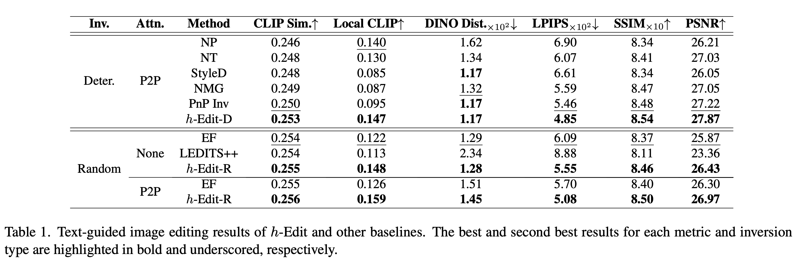
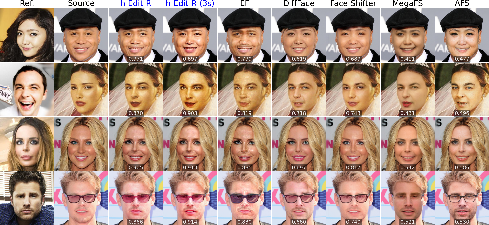

# *h*-Edit: Effective and Flexible Diffusion-Based Editing via Doob’s *h*-Transform (CVPR'25)

<a href="https://arxiv.org/pdf/2503.02187"></a>

## Summary

*h*-Edit is a finetuning-free diffusion-based editing method that frames editing as a *reverse-time bridge modeling problem*. It leverages `Doob’s h-Transform` for bridge construction and `Langevin Monte Carlo sampling` for generating edited samples.

## 🔥 Key Features

✅ **Theoretical Guarantee** - Provides both explicit and implicit forms with unique features. Math doesn't lie! 📏  
🚀 **Training-Free, Simple, General** - Smarter edits, zero headaches! 🧠  
🏆 **Strong Performance, SOTA on PieBench** - Tackles tough cases like a champ! 💪   
🛠️ **Flexible** - Supports conditional scores, external reward models; the first to handle both simultaneously! 🎛️  
🎯 **Compatible** - Works with deterministic/random inversion, P2P, MasaCtrl and Plug-n-Play or even without attention control! 🔄  
🔌 **Plug-and-Play** - Just add a pretrained diffusion model, whether for images, text, audio, or graphs, and you're all set! ✨ 

## 🔬 Experiments

We showcase *h*-Edit's capabilities in three settings: **text-guided editing** (conditional scores), **face swapping** (external reward models), and **combined text-guided & style editing** (both). Each experiment is linked below.

- 📝 [**Text-Guided Editing**](https://github.com/nktoan/h-edit/tree/main/text-guided)

- 👥 [**Face Swapping**](https://github.com/nktoan/h-edit/tree/main/face-swapping)

- 🎨 [**Combined Text-Guided & Style Editing**](https://github.com/nktoan/h-edit/tree/main/text-guided-n-style)

> 📢 📢 📢 If *h*-Edit helps your work, we’d love your feedback! Please cite our paper and giving us a ⭐ - it means a lot! 🚀

> [!IMPORTANT]
> If this repository is useful for your work, please cite it:
>
> ```LaTeX
> ```

## 🏆 Notable Results

### 📊 SOTA on PieBench



### 📝 Text-Guided Editing Visualizations


### 👥 Face Swapping Visualizations



### 🎨 Combined Text-Guided & Style Editing Visualizations


## 📌 To-Do List

- [ ] Webpage
- [ ] App Demo
- [ ] HuggingFace Implementation