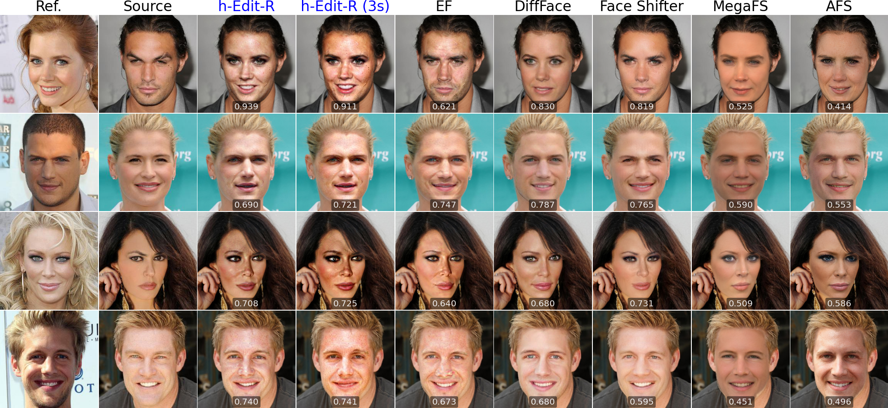
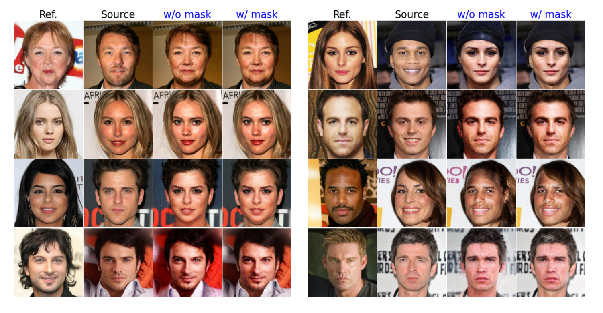

# *h*-Edit: Effective and Flexible Diffusion-Based Editing via Doob’s *h*-Transform (CVPR'25)

<a href="https://arxiv.org/pdf/2503.02187"></a>

This sub-folder contains **face swapping** experiments with *h*-Edit. The goal is to swap a reference face with a source face while preserving hair, pose, expression, and background. We use the **human face diffusion model** from the [SDEdit repository](https://github.com/ermongroup/SDEdit), pretrained on **CelebA-HQ**, along with a pretrained [ArcFace model](https://arxiv.org/abs/1801.07698) as the reward model for editing.

## 🚀 Installation and Quick Start

### 🛠️ Environment setup

We provide the environment file `environment_edit_face.yaml`. Create the environment with:  

```bash
conda env create -f environment_edit_face.yaml
```

All experiments are run on **NVIDIA V100 32GB** gpus.

### 📥 Download Pretrained Weights

- Download the **human face diffusion model, ArcFace model, and face parsing model**, and place them in `./weights/` under their respective folders.  
  ➡️ [Download here](https://drive.google.com/drive/folders/1gIcKaTZiYRg2gSmjkjunT4DsTpHvAiYn?usp=sharing)  

- Ensure you have the **CelebA-HQ dataset** for testing.  
  ➡️ [Download here](https://github.com/switchablenorms/CelebAMask-HQ)  

### 🎬 Running Demo

Try a quick demo with our method: **implicit *h*-Edit-R**. You can also experiment with your own images! Simply run: 

```bash
python main_edit.py --mode="h_edit_R"
```

If you **do not** want to apply masks as post-processing, use the `post_processing` flag:

```bash
python main_edit.py --mode="h_edit_R" --post_processing
```

## 💡 Tips & Usage Guide  

- 🎛️ **Tuning `weight_edit_face`** – Adjust to control the strength of face editing. Experiment to find the best balance!  
- 🔄 **Optimizing `optimization_steps`** – Our implicit *h*-Edit-R supports multiple optimization steps for better results than a single step. By default, it's set to **3**, but feel free to tweak it!  
- 🎭 **No Mask? No Problem!** – Our method works well even without masks as a post-processing step.  
  📖 *See our paper for more details!*  

## 🏆 Notable Results  

### 🖼️ Face Swapping Visualization  

<p align="center">
  
</p>

### 🎭 Works Well Without Masks  
<p align="center">
  
</p>

## 🎖️ Acknowledge

We acknowledge the following implementations used in our development of *h*-Edit:  

- [FreeDom](https://github.com/vvictoryuki/FreeDoM)  
- [SDEdit](https://github.com/ermongroup/SDEdit)  
- [AFS](https://github.com/vutru00/AFS)  

A huge thanks to these amazing works! 🙌 

## 📬 Contact

If you have any questions or suggestions, feel free to reach out!


