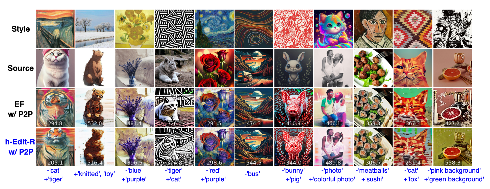

# *h*-Edit: Effective and Flexible Diffusion-Based Editing via Doob’s *h*-Transform (CVPR'25)

<a href="https://arxiv.org/pdf/2503.02187"></a>

This sub-folder contains experiments on **combined text-guided and style editing** with *h*-Edit. Given an image, its source prompt, and a style image, we generate an edited image based on a target prompt while ensuring its style matches that of the style image.

# 🚀 Installation and Quick Start

## 🛠️ Environment setup

We provide the environment file `environment_p2p.yaml`. Create the environment with:  

```bash
conda env create -f environment_p2p.yaml
```

All experiments are run on **NVIDIA V100 32GB** gpus.

## 🎬 Running Demo

Try a quick demo with our method: **implicit *h*-Edit-R + P2P**. You can also experiment with your own images! Simply run: 

```bash
python main_edit.py --mode="h_edit_R_p2p"
```

You can run a demo with the baseline **EF + P2P** using the following command:

```bash
python main_edit.py --mode="ef_p2p"
```

# 💡 Tips & Usage Guide  

- 🎛️ **Tuning `weight_edit_clip`** – Adjust to control the strength of style editing. Experiment to find the best balance!  
  - For *h*-Edit-R + P2P, **[0.4, 0.8]** works well.  
  - For EF + P2P, **[1.0, 2.0]** is preferred.  

- 🔧 **Setting $\hat{w}^{orig}$** – Keep it **close to** $w^{edit}$ for optimal reconstruction & editing, similar to text-guided editing.  
  - If too high, lower it—matching or exceeding $w^{edit}$ may be sub-optimal (see our paper!).

- ⚙️ **Fine-tuning P2P Parameters** – Adjust `xa`, `sa` for better control.  
  - 🚫 **Avoid `local_blend`** – We find that it negatively impacts performance in this setting.
  - Experiment with your own settings for the best results!  

# 🏆 Notable Results  

## 🎨 Combined Text-Guided & Style Editing Visualizations



# Acknowledge

We acknowledge the following implementations used in our development of *h*-Edit:  

- [FreeDom](https://github.com/vvictoryuki/FreeDoM)  
- [Edit Friendly](https://github.com/inbarhub/DDPM_inversion)
- [Prompt-to-Prompt](https://github.com/google/prompt-to-prompt)  

A huge thanks to these amazing works! 🙌 

# 📬 Contact

If you have any questions or suggestions, feel free to reach out!
