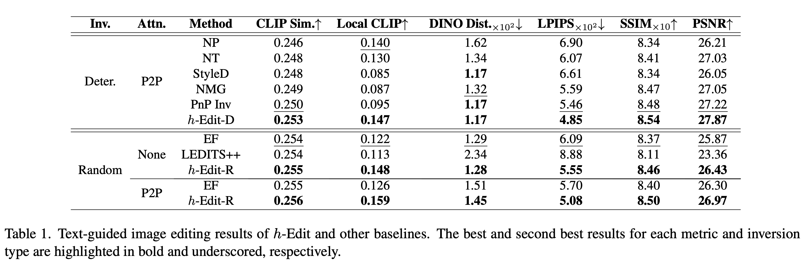
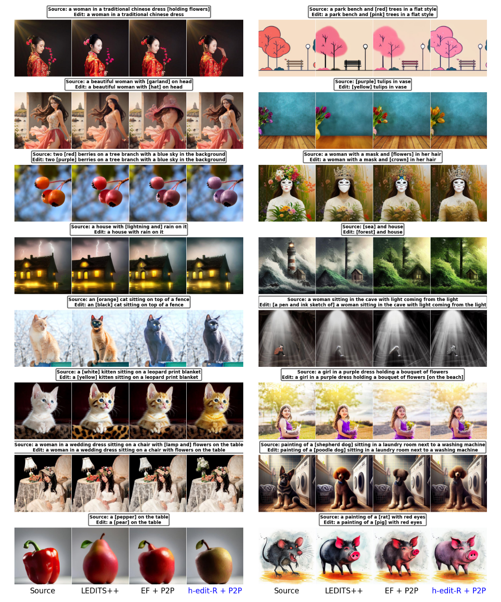
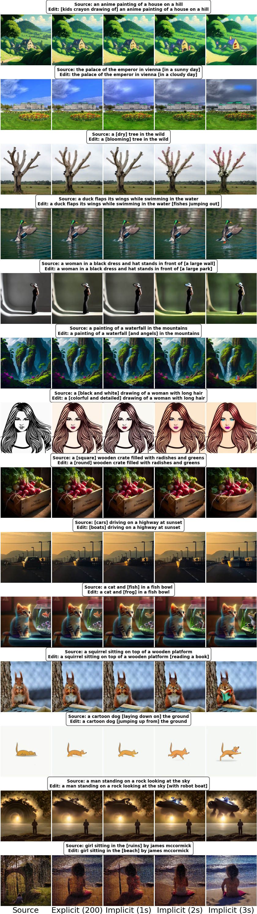

# *h*-Edit: Effective and Flexible Diffusion-Based Editing via Doob’s *h*-Transform (CVPR'25)

<a href="https://arxiv.org/pdf/2503.02187"></a>

This sub-folder contains experiments on **text-guided editing** with *h*-Edit. Given an image and its source prompt, we generate edited images that align with a target prompt derived from the source.

## 🚀 Installation and Quick Start

### 🛠️ Environment setup

We provide environment files for each attention control: `environment_p2p.yaml`, `environment_masactrl.yaml`, and `environment_pnp.yaml`.  For h-Edit-R without Attention Control, use `environment_p2p.yaml`. Create the corresponding environment with:

```bash
conda env create -f environment_p2p.yaml
```

For the installation of `CLIP`, first activate the installed environment and then run:  

```bash
pip install --no-cache-dir git+https://github.com/openai/CLIP.git
```

All our experiments are conducted on **NVIDIA V100 32GB** GPUs.

### 🎬 Running Demo

We provide a quick demo with our strongest version, **implicit *h*-Edit-R + P2P**. You can also use your own images and source prompts to experiment with any target prompt!

```bash
python main_demo.py --implicit
```

### 📊 Running PieBench

Reproduce our SOTA results on PieBench in *four* steps: 

1️⃣ **Prepare Dataset** - Download it [here](https://github.com/cure-lab/PnPInversion). No dataset, no party! 🎉

2️⃣ **Setup Environment** - Follow the instructions above for each attention control method. ⚡

3️⃣ **Configure & Run** - Key parameters are pre-set in `main_{attention_control}.py`. We’ve got main files for all methods. Feeling lazy? 💤 Just grab our *h*-Edit scripts from `/scripts` and run! 

4️⃣ **Run Evaluation** - Run `evaluation.py` in `/evaluation`, and coffee time ☕ ✨

## 💡 Tips & Usage Guide  

### 🎯 Choosing Attention Control  
- **P2P** is the recommended default.  
- **Need pose edits?** Use **MasaCtrl** (e.g., sitting → standing).  
- **No attention control?** *h*-Edit-R benefits from skipping initial steps for faithfulness.  

### ⚙️ Using *h*-Edit Effectively  

- **Random vs. Deterministic Inversion** - *h*-Edit-R (🎲) generally performs better, except for *MasaCtrl*, where *h*-Edit-D is preferred.
- **Implicit vs. Explicit Form** - Implicit *h*-Edit is best for tough cases with unique optimization steps. But explicit form can also work well - give it a try!  
- **Set** $\hat{w}^{\text{orig}}$ **close to** $w^{\text{edit}}$ for *optimal* reconstruction & editing. If too high, lower it—matching or exceeding $w^{\text{edit}}$ may be suboptimal (see our paper!).  
- **For tough cases, try:**  
  1️⃣ Increasing both $w^{\text{edit}}$ and $\hat{w}^{\text{orig}}$.  
  2️⃣ Using implicit *h*-Edit with *multiple optimization steps*, adjust reconstruction weight for better results.  
- **Fine-tune P2P Parameters** - Adjust `xa`, `sa` for better control:  
  - `xa = 0.4`, `sa = 0.6` for *h*-Edit-D on PieBench  
  - `xa = 0.4`, `sa = 0.35` for *h*-Edit-R on PieBench  
  - Experiment with your own settings for optimal results!  

🚀 **Check out our paper for more details - then go edit like a pro!** ✨

## 🏆 Notable Results

### 📊 SOTA on PieBench



### ⚖️ *h*-Edit-D vs. Baselines


### ⚖️ *h*-Edit-R vs. Baselines



### 🔍 Impact of $\hat{w}^{\text{orig}}$  

<p align="center">
  
</p>

### 🔍 Robust to $(w^{\text{edit}}, \hat{w}^{\text{orig}})$  

<p align="center">
  
</p>

### 🔄 Effect of Implicit Multiple Optimization Steps (1 → 3)

<p align="center">
  
</p>

## 🎖️ Acknowledgments

We acknowledge the following implementations used in our development of *h*-Edit:  

- [Edit Friendly](https://github.com/inbarhub/DDPM_inversion)  
- [PnP Inversion](https://github.com/cure-lab/PnPInversion/)  
- [Noise Map Guidance](https://github.com/hansam95/NMG)  
- [Prompt-to-Prompt](https://github.com/google/prompt-to-prompt)  

A huge thanks to these amazing works! 🙌 

## 📬 Contact

If you have any questions or suggestions, feel free to reach out!